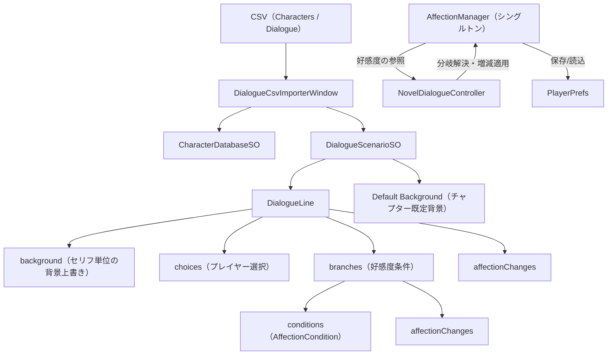

# 好感度システム 仕様書・使用方法

ビジュアルノベルにおける「キャラクターごとの好感度（Affection）」を管理し、セリフやシーンの分岐に利用するためのシステムです。既存の CSV 駆動ダイアログシステムを拡張する形で実装されています。

---

## 1. 概要

本システムは以下の役割を持ちます。

1. **好感度の保持・操作** — キャラクター ID ごとの好感度を保持し、加算・設定・取得を行います。
2. **好感度の永続化** — シーンを跨いで値を保持し、`PlayerPrefs` に保存・復元します。
3. **セリフの分岐** — プレイヤーの選択肢または好感度の値に応じて、次のセリフを切り替えます。
4. **好感度の増減** — セリフの表示や分岐の選択時に好感度を変化させます。

好感度は `0` から `maxValue`（初期値 100）の範囲で保持されます。

---

## 2. ファイル構成

| パス | 役割 |
| --- | --- |
| `Assets/Scripts/Affection/AffectionManager.cs` | 好感度の保持・操作・保存を担うシングルトン |
| `Assets/Scripts/Affection/AffectionCondition.cs` | 好感度の分岐条件（キャラ・比較演算子・閾値） |
| `Assets/Scripts/Affection/AffectionDelta.cs` | 好感度の増減量（キャラ・値） |
| `Assets/Scripts/Dialogue/Runtime/DialogueScenarioSO.cs` | `DialogueLine` / `DialogueBranch` の定義 |
| `Assets/Scripts/Dialogue/Runtime/NovelDialogueControllerSO.cs` | ダイアログ再生と分岐解決 |
| `Assets/Scripts/Dialogue/Editor/CsvParser.cs` | CSV パーサ（`TryGet` 追加） |
| `Assets/Scripts/Dialogue/Editor/DialogueCsvImporterWindow.cs` | CSV から ScriptableObject を生成するインポーター |

---

## 3. アーキテクチャ



- `DialogueLine.affectionChanges` は、そのセリフが**表示されたとき**に好感度へ適用されます。
- `DialogueScenarioSO.DefaultBackground` は、チャプター開始時に表示される既定背景です。
- `DialogueLine.background` は、設定されたセリフの表示時に現在の背景を上書きします。
- `DialogueLine.choices` は、セリフの表示完了後にプレイヤーへ表示されます。
- `DialogueLine.branches` は、そのセリフの**次に進むとき**に評価され、条件を満たした分岐先へ移動します。
- 分岐の選択時に `DialogueBranch.affectionChanges` が追加で適用されます。
- 選択肢と好感度分岐は同じシナリオ内で使い分けられますが、動作が曖昧になるため同じセリフ行には同時設定できません。

---

## 4. 主要クラス仕様

### 4.1 AffectionManager

`MonoBehaviour` のシングルトンです。`DontDestroyOnLoad` によりシーンを跨いで保持されます。

#### インスペクタ項目

| 項目 | 型 | 初期値 | 説明 |
| --- | --- | --- | --- |
| `Min Value` | int | `0` | 好感度の下限 |
| `Max Value` | int | `100` | 好感度の上限 |
| `Initial Values` | List | 空 | 初期好感度（`characterId` と `value` のリスト） |
| `Save Key` | string | `"AffectionState"` | `PlayerPrefs` の保存キー |
| `Load On Awake` | bool | `true` | 起動時に保存値を読込むか |
| `Save On Change` | bool | `true` | 変化のたびに自動保存するか |

#### プロパティ / イベント

| 名前 | 型 | 説明 |
| --- | --- | --- |
| `Instance` | `AffectionManager` | シングルトンインスタンス |
| `OnAffectionChanged` | `Action<string, int, int>` | 変化時に `(characterId, 旧値, 新値)` を通知 |
| `OnAffectionReset` | `Action` | 全リセット時に通知 |

#### メソッド

| メソッド | 説明 |
| --- | --- |
| `int GetAffection(string characterId)` | 指定キャラの好感度を取得。未登録は `0` |
| `bool TryGetAffection(string characterId, out int value)` | 存在する場合のみ取得 |
| `void SetAffection(string characterId, int value)` | 好感度を設定（クランプ後） |
| `void AddAffection(string characterId, int delta)` | 好感度を加算 |
| `void ApplyDelta(AffectionDelta delta)` | `AffectionDelta` を適用 |
| `void ApplyDeltas(IReadOnlyList<AffectionDelta> deltas)` | 複数の増減を適用 |
| `bool Evaluate(AffectionCondition condition)` | 条件の真偽を評価 |
| `bool EvaluateAll(IReadOnlyList<AffectionCondition> conditions)` | 全条件（AND）の真偽を評価 |
| `IReadOnlyDictionary<string, int> Snapshot()` | 全好感度のコピーを取得 |
| `void ResetAll()` | 初期値に戻す |
| `void Save()` | `PlayerPrefs` に保存 |
| `void Load()` | `PlayerPrefs` から復元 |

### 4.2 AffectionCondition

好感度の分岐条件です。

| フィールド | 型 | 説明 |
| --- | --- | --- |
| `characterId` | string | 対象キャラクター ID |
| `comparison` | `ComparisonType` | 比較演算子 |
| `value` | int | 閾値 |

`ComparisonType` の値:

- `GreaterOrEqual`（`>=`）
- `Greater`（`>`）
- `LessOrEqual`（`<=`）
- `Less`（`<`）
- `Equal`（`==`）
- `NotEqual`（`!=`）

### 4.3 AffectionDelta

好感度の増減量です。

| フィールド | 型 | 説明 |
| --- | --- | --- |
| `characterId` | string | 対象キャラクター ID |
| `value` | int | 増減量（負の値で減少） |

### 4.4 DialogueLine の追加フィールド

既存の `DialogueLine` に以下が追加されています。

| フィールド | 型 | 説明 |
| --- | --- | --- |
| `background` | `Sprite` | そのセリフ表示時に切り替える背景。未設定なら現在の背景を維持 |
| `choices` | `List<DialogueChoice>` | プレイヤーが選ぶ表示文と遷移先 |
| `affectionChanges` | `List<AffectionDelta>` | 表示時に適用する好感度の増減 |
| `branches` | `List<DialogueBranch>` | 好感度による分岐リスト（先頭から評価） |

### 4.5 DialogueBranch

分岐先を定義します。

| フィールド | 型 | 説明 |
| --- | --- | --- |
| `nextLineId` | string | 条件成立時の遷移先セリフ ID |
| `conditions` | `List<AffectionCondition>` | すべて満たす必要がある条件（AND） |
| `affectionChanges` | `List<AffectionDelta>` | 分岐選択時に追加適用する増減 |

### 4.6 NovelDialogueController

`AffectionManager` を参照するためのインスペクタ項目 `Affection Manager` が追加されています。未設定の場合は `AffectionManager.Instance` へ自動フォールバックします。

セリフ表示完了後の解決順序は以下のとおりです。

1. `choices` がある場合は選択肢を表示し、プレイヤーが選んだ遷移先へ移動
2. 選択肢がない場合、`branches` を先頭から評価し、最初に条件を満たした分岐先へ移動
3. 好感度分岐が無い・一致しない場合は `nextLineId` へ移動
4. `nextLineId` も空の場合は CSV 上の次の行へ移動

チャプター開始時は `Default Background` へ切り替えられ、セリフに `background` が設定されている場合はその背景が上書き適用されます。

---

## 5. CSV フォーマット

背景、選択肢、好感度分岐を含むダイアログ CSV は次の列構成です。`choiceNText` / `choiceNNextLineId` は必要な数だけ追加でき、`backgroundPath` / `affectionChanges` / `branches` は省略可能です。

```
lineId,speakerId,expressionId,backgroundPath,text,nextLineId,choice1Text,choice1NextLineId,choice2Text,choice2NextLineId,affectionChanges,branches
```

### 5.1 backgroundPath（背景切り替え）

セリフ表示時に背景を切り替える場合は、`Assets/` から始まる背景Spriteのパスを設定します。

```csv
backgroundPath
Assets/Art/Backgrounds/station_platform_twilight.png
```

- 空欄の場合は、直前まで表示していた背景を維持します。
- チャプター開始時は、各 `DialogueScenarioSO` の `Default Background` が先に適用されます。
- 最初のセリフの `backgroundPath` に値がある場合は、チャプター既定背景をさらに上書きします。
- 画像の Unity Import Settings は `Texture Type: Sprite (2D and UI)` にしてください。

### 5.2 choices（プレイヤー選択）

`choiceNText` と `choiceNNextLineId` を同じ番号のペアで設定します。選択肢を設定した行の `nextLineId` と `branches` は空欄にしてください。

```csv
choice1Text,choice1NextLineId,choice2Text,choice2NextLineId
駅へ行く,chapter1_station,公園へ行く,chapter1_park
```

### 5.3 affectionChanges（好感度の増減）

そのセリフが表示されたときに適用されます。`キャラクターID+値`（加算）または `キャラクターID-値`（減算）を `;` 区切りで並べます。

```
kayo+5; doute-2
```

### 5.4 branches（好感度による分岐）

`条件->遷移先セリフID` の形式で、`;` 区切りで並べます。条件は `キャラクターID 演算子 数値` です。

```
kayo>=5->prologue_good; kayo<5->prologue_bad
```

複数条件を `&` で結合すると AND 条件になります。

```
kayo>=5&doute>=3->special_ending
```

#### 使用できる演算子

| 演算子 | 意味 |
| --- | --- |
| `>=` | 以上 |
| `>` | より大きい |
| `<=` | 以下 |
| `<` | より小さい |
| `==` | 等しい |
| `!=` | 等しくない |

### 5.5 記入例

```csv
lineId,speakerId,expressionId,backgroundPath,text,nextLineId,choice1Text,choice1NextLineId,choice2Text,choice2NextLineId,affectionChanges,branches
prologue_001,kayo,normal,Assets/Art/Backgrounds/station_plaza_sunset.png,「今日はありがとう、デート楽しかったわ」,prologue_002,,,,,kayo+5,
prologue_002,kayo,normal,,どっちへ行く？,,駅へ行く,prologue_station,公園へ行く,prologue_park,,
prologue_station,doute,normal,Assets/Art/Backgrounds/station_platform_twilight.png,駅へ向かおう,prologue_check,,,,,doute+2,
prologue_park,doute,normal,Assets/Art/Backgrounds/station_platform_twilight.png,公園へ向かおう,prologue_check,,,,,doute+1,
prologue_check,kayo,normal,,それじゃあまたね,,,,,,,kayo>=5->prologue_good; kayo<5->prologue_bad
prologue_good,kayo,normal,,「……次も楽しみにしてる」,,,,,,,
prologue_bad,kayo,normal,,「また機会があったらね」,,,,,,,
```

> 上記は例示です。実際のゲーム内容には合わせて調整してください。

### 5.6 バリデーション

CSV インポート時に以下の検証が行われます。

- `affectionChanges` / `branches` で参照するキャラクター ID が `Characters.csv` に存在すること
- `backgroundPath` が存在する背景Spriteを参照していること
- 選択肢の表示文と遷移先がペアで設定されていること
- 選択肢の遷移先が同じダイアログ CSV 内に存在すること
- 選択肢と好感度分岐が同じ行に同時設定されていないこと
- 分岐先のセリフ ID が同じダイアログ CSV 内に存在すること
- `lineId` の重複が無いこと
- 分岐条件・増減の記法が正しいこと

---

## 6. セットアップ手順

1. 最初に読み込むシーン（例: `Title.unity`）に空の `GameObject` を作成します。
2. その `GameObject` に `AffectionManager` コンポーネントをアタッチします。
   - 必要に応じて `Min Value` / `Max Value` / `Initial Values` を設定します。
3. `DontDestroyOnLoad` により、以降のシーンへ自動的に引き継がれます。
4. `Tools > Dialogue > CSV Importer` を開き、CSV と出力先の ScriptableObject を設定してインポートします。
5. 各 `DialogueScenarioSO` の `Default Background` にチャプター開始時の背景を設定します。
6. `NovelDialogueController` の `Affection Manager` 欄は未設定でも動作します（`Instance` にフォールバック）。

> 新規追加したスクリプトの `.meta` ファイルは Unity が自動生成します。

---

## 7. 使用方法（スクリプト例）

### 7.1 好感度の取得・変更

```csharp
using UnityEngine;

public sealed class SampleAffectionUser : MonoBehaviour
{
    private void Start()
    {
        AffectionManager affection = AffectionManager.Instance;

        // 取得
        int kayo = affection.GetAffection("kayo");

        // 加算・減算
        affection.AddAffection("kayo", 5);
        affection.AddAffection("kayo", -3);

        // 直接設定
        affection.SetAffection("kayo", 50);
    }
}
```

### 7.2 好感度によるシーン分岐

```csharp
using UnityEngine;
using UnityEngine.SceneManagement;

public sealed class SampleSceneBranch : MonoBehaviour
{
    public void GoToNextScene()
    {
        AffectionManager affection = AffectionManager.Instance;

        if (affection.GetAffection("kayo") >= 50)
        {
            SceneManager.LoadScene("KayoGoodEnding");
        }
        else
        {
            SceneManager.LoadScene("KayoNormalEnding");
        }
    }
}
```

### 7.3 変化イベントの購読（UI 更新など）

```csharp
private void OnEnable()
{
    AffectionManager.Instance.OnAffectionChanged += HandleChanged;
}

private void OnDisable()
{
    if (AffectionManager.Instance != null)
    {
        AffectionManager.Instance.OnAffectionChanged -= HandleChanged;
    }
}

private void HandleChanged(string characterId, int oldValue, int newValue)
{
    Debug.Log($"{characterId}: {oldValue} -> {newValue}");
}
```

### 7.4 条件の評価

```csharp
AffectionManager affection = AffectionManager.Instance;

var condition = new AffectionCondition
{
    characterId = "kayo",
    comparison = AffectionCondition.ComparisonType.GreaterOrEqual,
    value = 50
};

bool isMet = affection.Evaluate(condition);
```

---

## 8. 保存・永続化

- 好感度が変化すると `Save On Change` が有効な場合、自動的に `PlayerPrefs` へ保存されます。
- 起動時は `Load On Awake` が有効な場合、保存値が復元されます。
- 保存キーは `Save Key` で変更できます（初期値 `AffectionState`）。
- 保存データを手動で消すには、`Tools > Affection > Clear Saved Data` を使用します。

---

## 9. エディタメニュー

| メニュー | 説明 |
| --- | --- |
| `Tools > Dialogue > CSV Importer` | CSV から ScriptableObject を生成 |
| `Tools > Affection > Clear Saved Data` | 保存された好感度データを削除 |

---

## 10. 注意事項・制限

- 好感度のキャラクター ID は `Characters.csv` の `characterId` と一致させる必要があります。
- 好感度の上限・下限はグローバル設定（全キャラ共通）です。キャラごとに異なる範囲を持たせる場合は `AffectionManager` の拡張が必要です。
- CSV の `affectionChanges` では、`+`/`-` の後ろに数値が続く必要があります。キャラクター ID に `+` や `-` を含めることは想定していません。
- `branches` の条件は先頭から評価され、**最初に一致した分岐のみ**が採用されます（フォールスルーしません）。
- 分岐でどの条件にも一致しなかった場合は、通常の `nextLineId`（または連番）へ進みます。
- `AffectionManager` がシーン上に存在しない状態で好感度分岐を含むセリフを再生した場合、分岐はスキップされ警告が出力されます。
