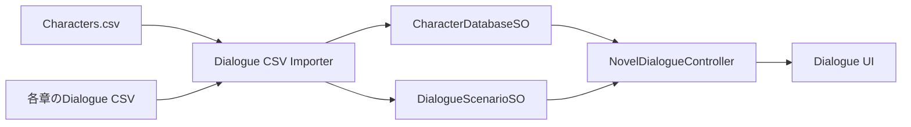
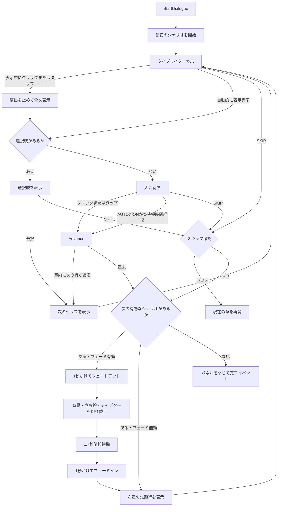

# Dialogueシステム仕様・運用ガイド

最終更新: 2026-08-26

## 概要

本プロジェクトのDialogueシステムは、CSVで作成したキャラクター情報と会話内容をUnity Editor上でScriptableObjectへ変換し、実行時にTextMeshProとuGUIを使って表示する仕組みです。セリフごとにプレイヤー選択肢と遷移先を設定し、同じ章の中で会話を分岐できます。

複数の`DialogueScenarioSO`を順番に登録できるため、次のように章をまたいで物語を連続再生できます。

```text
Prologue
  ↓
Chapter 1
  ↓
Chapter 2
  ↓
全シナリオ終了
```

章が切り替わる際、会話パネルは閉じません。前の章の最終セリフから次の章の先頭セリフへ、そのまま表示が切り替わります。最後に登録された章が終了したときだけ会話パネルを閉じ、完了イベントを呼び出します。

## 関連ファイル

### Runtime

| ファイル | 役割 |
| --- | --- |
| [`CharacterDatabaseSO.cs`](../Assets/Scripts/Dialogue/Runtime/CharacterDatabaseSO.cs) | キャラクター名、名前色、表情、立ち絵を保持する |
| [`DialogueScenarioSO.cs`](../Assets/Scripts/Dialogue/Runtime/DialogueScenarioSO.cs) | 1つのシナリオに含まれるセリフと遷移情報を保持する |
| [`NovelDialogueControllerSO.cs`](../Assets/Scripts/Dialogue/Runtime/NovelDialogueControllerSO.cs) | 会話の開始、文字送り、章送り、終了、UI更新を制御する |

`NovelDialogueControllerSO.cs`というファイル名ですが、定義されている`NovelDialogueController`はScriptableObjectではなく`MonoBehaviour`です。

### Editor

| ファイル | 役割 |
| --- | --- |
| [`CsvParser.cs`](../Assets/Scripts/Dialogue/Editor/CsvParser.cs) | CSVをヘッダーとレコードへ変換する |
| [`DialogueCsvImporterWindow.cs`](../Assets/Scripts/Dialogue/Editor/DialogueCsvImporterWindow.cs) | CSVを検証し、キャラクターDBとシナリオへ保存する |

### 現在のデータ

| ファイル | 内容 |
| --- | --- |
| [`Characters.csv`](../Assets/Dialogue/CSV/Characters.csv) | キャラクターと表情の入力データ |
| [`prologue_station.csv`](../Assets/Dialogue/CSV/Prologue/prologue_station.csv) | 現在のプロローグ本文 |
| [`CharacterDatabase.asset`](../Assets/Dialogue/Data/CharacterDatabase.asset) | インポート済みキャラクターデータ |
| [`Prologue.asset`](../Assets/Dialogue/Data/Prologue.asset) | インポート済みプロローグ |

現時点ではChapter 1とChapter 2のCSVおよび`DialogueScenarioSO`はまだ作成されていません。

## データの流れ



CSVは実行時に直接読み込みません。EditorでCSVをインポートした時点で内容をScriptableObjectへ保存し、ゲーム実行時は保存済みアセットを参照します。

## キャラクターCSV

### 列構成

```csv
characterId,displayName,nameColor,expressionId,portraitPath,nameKnownInitially
```

| 列 | 必須 | 説明 |
| --- | --- | --- |
| `characterId` | 必須 | キャラクターを識別するID。大文字と小文字は区別される |
| `displayName` | キャラクターの最初の行では必須 | 名前欄へ表示する文字列 |
| `nameColor` | 任意 | HTML形式の名前色。空欄の場合は白。例：`#FFFFFF` |
| `expressionId` | 必須 | 表情ID。例：`normal`、`surprised` |
| `portraitPath` | 必須 | Unityプロジェクト内のSpriteパス |
| `nameKnownInitially` | 任意 | 会話開始時から本名を表示するか。`true`なら本名、`false`または空欄なら`???` |

同じキャラクターへ複数の表情を登録するときは、同じ`characterId`で行を追加します。

```csv
characterId,displayName,nameColor,expressionId,portraitPath,nameKnownInitially
kayo,ミオ,#80C8FF,normal,Assets/Art/Portraits/kayo_normal.PNG,false
kayo,,#80C8FF,smile,Assets/Art/Portraits/kayo_smile.PNG,
```

2行目以降の`displayName`と`nameKnownInitially`は空にできます。値を書く場合は、そのキャラクターの最初の行と完全に一致させる必要があります。

### 名前の公開状態

`nameKnownInitially`が`false`または空欄のキャラクターは、名前が公開されるまで名前欄へ`???`と表示されます。最初から名前を表示したいキャラクターだけ`true`にします。

会話CSVの自己紹介行で`revealSpeakerName`を`true`にすると、そのセリフが全文表示された直後に話者の名前が公開されます。自己紹介中は`???`のまま表示され、全文表示後に本名へ切り替わります。

```csv
lineId,speakerId,text,nextLineId,revealSpeakerName
chapter1_001,kayo,私はカヨです,chapter1_002,true
chapter1_002,kayo,よろしくね,,
```

公開状態は後続チャプターへ引き継がれます。`StartDialogue()`で会話全体を最初から開始した場合は、Characters.csvの初期状態へリセットされます。現在はセーブデータや別のUnityシーンへ公開状態を保存する機能はありません。

### 立ち絵の選択順

実行時の`CharacterData.GetPortrait()`は、以下の順でSpriteを探します。

1. セリフで指定された`expressionId`
2. `normal`
3. キャラクターに登録された最初の表情
4. どれもなければ`null`

取得結果が`null`の場合、対象となる左右いずれかのImageからSpriteを外し、Imageコンポーネントを無効化します。

ただし、通常のCSVインポートでは`portraitPath`が空、パスが間違っている、画像がSpriteとして読み込めない、といった場合にインポートエラーになります。

### 2キャラクターの配置

立ち絵は同時に2キャラクターまで表示できます。

| 位置 | 表示内容 |
| --- | --- |
| 左 | `Protagonist Character Id`で指定した主人公。現在値は`doute` |
| 右 | そのシナリオ内で最後に発言した非主人公キャラクター |

各シナリオの開始時に、左へ主人公の標準立ち絵を表示し、右を空に戻します。

- 主人公が発言した場合は左の表情だけを更新する
- 非主人公が発言した場合は右へ表示する
- 別の非主人公が発言した場合は右のキャラクターを差し替える
- 主人公の発言中は、右に登場済みの非主人公を維持する
- 非主人公がまだ発言していなければ右は空白のままにする
- 地の文では名前欄だけを消し、左右の立ち絵は維持する

このため、主人公しか登場していない場面では左だけが表示されます。

## 会話CSV

### 列構成

```csv
lineId,speakerId,expressionId,backgroundPath,text,nextLineId,choice1Text,choice1NextLineId,choice2Text,choice2NextLineId,revealSpeakerName
```

| 列 | 必須 | 説明 |
| --- | --- | --- |
| `lineId` | 必須 | シナリオ内でセリフを識別する一意のID |
| `speakerId` | 任意 | 発言者の`characterId`。空欄なら地の文 |
| `expressionId` | 任意 | 表示する表情。空欄なら立ち絵のフォールバック規則を使う |
| `backgroundPath` | 任意 | このセリフで切り替える背景Spriteの`Assets/...`パス。空欄なら現在の背景を維持 |
| `text` | 必須 | 表示する本文。文字列の`\n`は実際の改行へ変換される |
| `nextLineId` | 任意 | 次に表示するセリフID |
| `choiceNText` | 任意 | プレイヤーへ表示する選択肢。`N`は1以上の連番 |
| `choiceNNextLineId` | 選択肢使用時は必須 | 対応する選択肢を押したときの遷移先ID |
| `revealSpeakerName` | 任意 | `true`なら、このセリフの全文表示後に話者の本名を公開する |

例：

```csv
lineId,speakerId,expressionId,backgroundPath,text,nextLineId
chapter1_001,kayo,normal,,「ここからChapter 1よ」,chapter1_002
chapter1_002,doute,normal,Assets/Art/Backgrounds/station_platform_twilight.png,「先へ進もう」,
```

### 背景の切り替え

`DialogueScenarioSO` の `Default Background` はチャプター開始時に毎回適用されます。チャプターの途中で背景を変える場合は、対象セリフの `backgroundPath` へSpriteのパスを設定します。以降の空欄行ではその背景が維持され、次のチャプターに進むとそのチャプターの既定背景へ切り替わります。

### 同じ章の中での進み方

現在のセリフが全文表示されている状態で、画面の任意位置をクリックまたはタップすると、次の規則で進みます。

1. `nextLineId`が設定されていれば、そのIDのセリフへ移動する
2. `nextLineId`が空なら、CSV上の次の行へ移動する
3. CSV上にも次の行がなければ、その章を終了する

`nextLineId`は、選択肢がない行でCSVの並びとは異なる場所へ無条件に移動したい場合に使用します。

### 選択肢による分岐

選択肢を使う場合は、同じ番号の`choiceNText`と`choiceNNextLineId`をセットで追加します。使用する番号の列だけCSVヘッダーへ追加でき、未使用セルは空欄にできます。

```csv
lineId,speakerId,expressionId,text,nextLineId,choice1Text,choice1NextLineId,choice2Text,choice2NextLineId
chapter1_001,kayo,normal,どちらへ行く？,,駅へ行く,chapter1_station,公園へ行く,chapter1_park
chapter1_station,doute,normal,駅へ向かおう,chapter1_join,,,,
chapter1_park,doute,normal,公園へ向かおう,chapter1_join,,,,
chapter1_join,kayo,normal,それじゃあ行きましょう,,,,,
```

`chapter1_001`の全文表示が完了すると「駅へ行く」と「公園へ行く」が表示されます。前者なら`chapter1_station`、後者なら`chapter1_park`へ移動し、どちらも最後は`chapter1_join`へ合流します。

選択肢付きの行では`nextLineId`を空にしてください。通常クリックとAUTOでは先へ進まず、プレイヤーがいずれかの選択肢を押したときだけ指定先へ移動します。遷移先は同じ`DialogueScenarioSO`内の`lineId`を指定します。

## CSVのインポート手順

Unity Editorで次のメニューを開きます。

```text
Tools > Dialogue > CSV Importer
```

以下の4項目を設定します。

1. `Character CSV`に`Characters.csv`を指定する
2. `Dialogue CSV`にインポートする章のCSVを指定する
3. `Character Database`に`CharacterDatabase.asset`を指定する
4. `Dialogue Scenario`にその章の出力先アセットを指定する
5. `CSVをインポート`を押す

インポートに成功すると、キャラクターDBと指定したシナリオの内容が全置換され、アセットが保存されます。

### 新しい章の作成

Chapter 1を追加する場合は、次の手順で作成します。

1. Projectウィンドウの`Assets/Dialogue/Data`で右クリックする
2. `Create > Dialogue > Dialogue Scenario`を選ぶ
3. アセット名を`Chapter1`にする
4. Chapter 1用のCSVを作る
5. CSV Importerの`Dialogue CSV`にChapter 1のCSVを指定する
6. `Dialogue Scenario`に`Chapter1.asset`を指定してインポートする

Chapter 2以降も同様です。インポーターは一度につき1つの会話CSVと1つの出力先シナリオを処理します。

## シーンへの設定

現在の会話コントローラーは[`NovelScene.unity`](../Assets/Scenes/GameMap/NovelScene.unity)内の`DialogueController`オブジェクトにあります。

### Dialogue Data

| Inspector項目 | 設定内容 |
| --- | --- |
| `Scenario` | 最初に再生するシナリオ。通常は`Prologue.asset` |
| `Following Scenarios` | プロローグ後に再生する章のリスト |
| `Character Database` | `CharacterDatabase.asset` |
| `Protagonist Character Id` | 左側へ表示する主人公ID。現在値は`doute` |
| `Unknown Speaker Name` | 名前が公開される前に表示する文字列。初期値は`???` |
| `Start Line Id` | 最初のシナリオの途中から始めたい場合のセリフID |

各 `DialogueScenarioSO` の `Default Background` に、そのチャプター開始時の背景を設定します。

Chapter 1、Chapter 2を作成した後、`Following Scenarios`を次のように設定します。

```text
Scenario: Prologue
Following Scenarios:
  Element 0: Chapter1
  Element 1: Chapter2
```

リストの順番が再生順です。Chapterを増やす場合は、同じリストの末尾へ追加します。

### Chapter Transition

チャプター末尾から次のチャプターへ移動するときは、画面全体を覆う暗転フェードを再生できます。

| Inspector項目 | 説明 | 初期値 |
| --- | --- | --- |
| `Use Chapter Transition Fade` | チャプター切替フェードのON/OFF | 有効 |
| `Chapter Fade Out Duration` | 画面が完全に暗転するまでの秒数 | `1` |
| `Chapter Fade Hold Duration` | 完全に暗転したまま待機する秒数 | `1.7` |
| `Chapter Fade In Duration` | 暗転から画面を表示するまでの秒数 | `1` |
| `Chapter Fade Color` | 画面を覆う色 | 黒 |

初期設定での再生順は次のとおりです。

```text
現在のチャプター
    ↓ 1秒かけてフェードアウト
完全に暗転
    ↓ 背景・立ち絵・チャプターを切り替える
1.7秒待機
    ↓ 1秒かけてフェードイン
次チャプターの文字送りを開始
```

暗転用のImageは実行時にCanvas内へ自動生成されるため、シーンに専用オブジェクトを作る必要はありません。フェード中は通常の会話送り、AUTO、SKIPを停止し、次チャプターのタイプライター表示もフェードイン完了まで待機します。時間計測には非スケール時間を使用するため、`Time.timeScale`の影響を受けません。

`Use Chapter Transition Fade`を無効にすると、従来どおり次チャプターへ即座に切り替わります。章末からの通常遷移だけでなく、SKIPによる次章移動にも同じ設定が適用されます。次に再生できるチャプターがない場合はフェードせず、Dialogue全体を終了します。

### UI

| Inspector項目 | 現在の参照先 |
| --- | --- |
| `Dialogue Root` | `DialoguePanel` |
| `Background Image` | `BackgroundImage` |
| `Name Plate` | 未設定 |
| `Speaker Name Text` | `SpeakerNameText` |
| `Body Text` | `DialogueText` |
| `Left Portrait Image` | `LeftPortraitImage` |
| `Right Portrait Image` | `RightPortraitImage` |
| `Playback Controls Root` | `PlaybackControls` |
| `Auto Play Button` | `AutoPlayButton` |
| `Auto Play Button Text` | `AutoPlayLabel` |
| `Skip Chapter Button` | `SkipChapterButton` |
| `Skip Confirmation Root` | `SkipConfirmation` |
| `Confirm Skip Button` | `ConfirmSkipButton` |
| `Cancel Skip Button` | `CancelSkipButton` |
| `Choice Options Root` | `ChoiceOptions` |
| `Choice Button Template` | `ChoiceButtonTemplate` |

`Name Plate`が未設定でも会話は動作します。地の文では名前文字列が空になりますが、名前プレート用の背景オブジェクトをまとめて非表示にしたい場合は、対象GameObjectを設定してください。

会話送り専用のButtonは使用しません。`NovelScene`にあった`NextButton`は削除されています。

右上には`AUTO`と`SKIP`の操作ボタンがあります。ボタン領域内のクリックは通常の会話送りとして扱われません。

### Choices

| Inspector項目 | 説明 |
| --- | --- |
| `Choice Button Height` | 選択肢ボタン1個の高さ。現在値は64 |
| `Choice Button Spacing` | 選択肢ボタン間の余白。現在値は12 |

`ChoiceButtonTemplate`は実行時に選択肢の個数だけ複製され、`ChoiceOptions`内へ縦に並びます。選択後は生成したボタンを破棄し、遷移先のセリフを表示します。

### Playback Controls

| Inspector項目 | 説明 |
| --- | --- |
| `Auto Advance Delay Seconds` | 全文表示完了後、自動で次へ進むまでの秒数。現在値は0.5 |
| `Auto Play On Start` | 有効なら会話開始時からAUTOをONにする。現在は無効 |

#### AUTO

`AUTO: OFF`を押すと`AUTO: ON`へ切り替わり、文字色が緑になります。もう一度押すとOFFへ戻ります。

AUTOがONの間は、タイプライター表示が完全に終わってから`Auto Advance Delay Seconds`だけ待ち、自動で次のセリフへ進みます。手動クリックでタイプライター演出を中止して全文表示した場合も、その時点から同じ待機時間を計測します。

AUTOの状態は章が切り替わっても維持されます。

#### SKIP

`SKIP`を押すと、画面中央に「現在の章をスキップします、本当によろしいですか？」という確認画面が表示されます。同時に画面全体へ半透明の黒いオーバーレイを表示し、`Time.timeScale`を`0`にしてゲームを一時停止します。

- `はい`: 確認画面と一時停止を解除し、現在の章に残っているセリフをすべて飛ばして次章へ移動する
- `いいえ`: 確認画面と一時停止を解除し、現在の章をそのまま継続する

確認中は通常の会話送り、タイプライター表示、AUTOの待機時間も停止します。`いいえ`を選んだ場合、AUTOの待機時間は確認画面を開く直前の残り時間から再開します。確認前からゲームが停止または減速されていた場合も、閉じる際に元の`Time.timeScale`へ戻します。

次章が未設定または空の場合は従来の章送りと同様にスキップし、それ以降の有効な章を探します。次の章が存在しなければDialogue全体を終了します。

### Text Animation

| Inspector項目 | 説明 |
| --- | --- |
| `Characters Per Second` | 1秒間に表示する文字数。現在値は40 |
| `Play On Start` | 有効ならシーン開始時に自動再生する |

### Events

`On Dialogue Completed`は、すべての章の再生が終わったときに一度だけ呼び出されます。章ごとには呼び出されません。

現在の`NovelScene`では、このイベントに処理は登録されていません。

## 実行時の再生フロー



章末で次のシナリオへ移る処理は`NovelDialogueController.TryStartNextScenario()`が担当します。

- `Following Scenarios`内の`null`は警告を出してスキップする
- セリフが1件もないシナリオも警告を出してスキップする
- 次に再生できるシナリオが見つかれば、その先頭行を表示する
- すべて確認して見つからなければDialogue全体を終了する

## タイプライター表示と画面入力

本文はTextMeshProの`maxVisibleCharacters`を利用して1文字ずつ表示します。

画面の任意位置をクリックまたはタップしたときの動作は、タイプライターの状態によって変わります。

- タイプライター表示中: 演出を中止し、現在のセリフを即座に全文表示する
- 全文表示後: 次のセリフまたは次の章へ進む
- 選択肢表示中: 通常クリックとAUTOを停止し、選択肢ボタンの入力だけを受け付ける
- チャプター切替フェード中: 通常クリック、AUTO、SKIP、次章のタイプライター表示を停止する

タイプライター表示中の1回の入力で、次のセリフまで進むことはありません。全文表示するための入力と、次へ進むための入力が分離されています。

入力には新Input Systemの`Pointer.current`を使用します。マウスのクリック、タッチスクリーンのタップ、ペン入力を同じ処理で検出するため、画面内の特定UIを押す必要はありません。

ただし、右上の`PlaybackControls`内は通常の画面送り判定から除外されます。AUTOやSKIPを操作したクリックで、同時にセリフまで進むことはありません。

通常の文字送りには`Time.unscaledDeltaTime`を使います。そのため、他の仕組みによって`Time.timeScale`が`0`になっても文字表示は進みます。ただし、スキップ確認画面を表示している間は明示的にタイプライター処理を待機させます。

## 公開メソッド

### `StartDialogue()`

最初に設定された`Scenario`から会話全体を開始します。`Start Line Id`が設定されていれば、そのIDから開始します。

### `StartDialogueAt(string lineId)`

`Start Line Id`を変更し、最初の`Scenario`内の指定行から会話を開始します。後続章のIDを直接指定して開始する機能ではありません。

### `Advance()`

タイプライター表示中なら演出を中止して現在のセリフを全文表示します。すでに全文表示されていれば、次の行への移動、次章への切り替え、全体終了のいずれかを行います。

### `ToggleAutoPlay()`

AUTO再生のON/OFFを切り替え、ボタンの表示と次回自動送り時刻を更新します。

### `ShowSkipConfirmation()`

スキップ確認画面を開き、ゲーム、タイプライター表示、AUTO待機を一時停止します。

### `ConfirmSkip()` / `CancelSkip()`

`ConfirmSkip()`は確認画面を閉じて次章へ移動します。`CancelSkip()`は確認画面を閉じ、現在の章とAUTO待機を再開します。どちらも確認前の`Time.timeScale`を復元します。

### `SkipToNextScenario()`

現在の章の残りを飛ばし、次に再生可能なシナリオへ移動します。次章がなければDialogueを終了します。

## インポート時の主な検証

次の場合、インポートは中止されてエラーダイアログが表示されます。

- 必須ヘッダーまたは必須値がない
- `characterId`と`expressionId`の組み合わせが重複している
- 同じキャラクターの`displayName`が行によって異なる
- 同じキャラクターの`nameKnownInitially`が行によって異なる
- `nameKnownInitially`または`revealSpeakerName`が`true`、`false`、`1`、`0`以外になっている
- `nameColor`をUnityのColorとして解析できない
- portraitをSpriteとして読み込めない
- `backgroundPath`の画像をSpriteとして読み込めない
- `lineId`が重複している
- `speakerId`がキャラクターCSVに存在しない
- `revealSpeakerName`が`true`なのに`speakerId`が空になっている
- 指定された表情がキャラクターに存在しない
- `nextLineId`の参照先が存在しない
- 選択肢の表示文または遷移先の片方だけが入力されている
- 選択肢付きの行に`nextLineId`も設定されている
- 選択肢の遷移先が同じシナリオ内に存在しない
- 同じ行の選択肢表示文が重複している

すべての検証が成功した場合だけ、ScriptableObjectが更新されます。

## 現在の注意事項

### 循環する遷移

`nextLineId`と選択肢の遷移先が存在することは検証されますが、循環参照は検出されません。

```text
line_a → line_b → line_a
```

このような設定では章末へ到達しないため、次章へ進みません。

### 現在未対応の機能

- ゲーム状態を使った条件分岐
- セーブデータからの章・行の復元
- 章開始／章終了ごとのイベント
- 会話履歴
- ボイス再生
- ローカライズ

## Chapter追加時のチェックリスト

- [ ] Chapter用CSVを作成した
- [ ] `lineId`を章内で重複させていない
- [ ] `speakerId`と`expressionId`がCharacters.csvに存在する
- [ ] 初期名表示が必要なキャラクターの`nameKnownInitially`を設定した
- [ ] 自己紹介行の`revealSpeakerName`を設定した
- [ ] `Default Background`または必要な行の`backgroundPath`を設定した
- [ ] 章の最後の行で意図しない次行へ進まないことを確認した
- [ ] 選択肢の表示文と遷移先IDをペアで設定した
- [ ] 選択肢付きの行では`nextLineId`を空にした
- [ ] Chapter用の`DialogueScenarioSO`を作成した
- [ ] CSV Importerで正しい出力先へインポートした
- [ ] `Following Scenarios`へ物語順に登録した
- [ ] `Use Chapter Transition Fade`とフェード時間を確認した
- [ ] 最終章終了時の`On Dialogue Completed`を必要に応じて設定した
- [ ] Play Modeでプロローグから次章へパネルを閉じずに進むことを確認した
